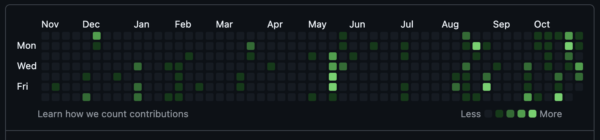

# 📊 Import Contributions to GitHub

A bash script that mirrors your contributions from **any Git repositories** (private, work, personal, from any platform) to a public GitHub repository, making your coding activity visible on your GitHub profile.

**Works with:** GitHub, GitLab, Bitbucket, Azure DevOps, self-hosted Git, or any Git repository.

## ⚖️ Important Disclaimer

> **🔒 This tool is 100% ethical and respects confidentiality**
>
> This script creates **empty commits with only timestamps** - it does NOT copy, share, or expose any actual code, business logic, or proprietary information from your work repositories.
>
> **What it does:**
>
> - ✅ Creates timestamped markers showing when you made commits
> - ✅ Preserves commit dates to reflect your actual activity
> - ✅ Helps showcase your professional coding consistency
>
> **What it does NOT do:**
>
> - ❌ Does NOT copy any source code
> - ❌ Does NOT expose project names or details
> - ❌ Does NOT share commit messages from original repositories
> - ❌ Does NOT violate any confidentiality agreements
>
> **Legal & Ethical:**
>
> - All commits are marked as generic "Activity"
> - No proprietary information is disclosed
> - Similar to listing work experience on LinkedIn
> - Respects employer intellectual property rights
>
> **Before using:** Always check your employment contract and company policies regarding public activity tracking.

---

## 📸 Before & After

<div align="center">

### Before Import 😔

_Empty contribution graph - all your work is invisible_



### After Import 🎉

_Full contribution graph showing your actual work activity_


</div>

---

## 🎯 Purpose

Many developers have contributions scattered across:

- 🏢 Private work repositories (company projects, client work)
- 🔒 Personal private projects (side projects, experiments)
- 🌐 Other platforms (GitLab, Bitbucket, Azure DevOps)
- 💼 Freelance projects (private client repos)
- 🏠 Self-hosted Git servers

All these contributions are **invisible** on your public GitHub profile. This script solves that problem by creating a mirror repository with timestamped commits that reflect your actual coding activity across all your repositories.

## ✨ Features

- 🔄 Works with **any Git repository** (GitHub, GitLab, Bitbucket, Azure DevOps, self-hosted)
- 📂 Scans multiple local git repositories at once
- 📅 Preserves original commit dates and times
- 👤 Uses your personal identity (name and email) for commits
- 🎯 Optional filtering by email address (work, personal, etc.)
- 📆 Optional filtering by start date (only recent commits)
- 📊 Generates detailed statistics and summary
- 🚀 Automatically pushes to GitHub
- ⚡ Handles large commit histories efficiently
- 🔒 100% safe - no code is copied, only timestamps

## 🚀 Quick Start

### Option 1: Using .env file (Recommended) ⭐

1. **Copy the example environment file**:

   ```bash
   cp env.example .env
   ```

2. **Edit .env with your information**:

   ```bash
   nano .env  # or use your favorite editor
   ```

3. **First, diagnose your repositories** to see what you have:

   ```bash
   ./diagnose-repos.sh  # Will use PROJECTS_DIR and FILTER_EMAIL from .env
   ```

4. **Create a GitHub repository** for your contributions (e.g., `username/work-contributions`)

5. **Run the import script** (it will read from .env):

   ```bash
   ./import-contributions.sh
   ```

6. **Wait 24 hours** for contributions to appear on your GitHub profile

### Option 2: Using Command Line Arguments

1. **First, diagnose your repositories** to see what you have:

   ```bash
   ./diagnose-repos.sh ~/work-projects your.work@company.com
   ```

2. **Create a GitHub repository** for your contributions (e.g., `username/work-contributions`)

3. **Get a GitHub token** (see instructions below)

4. **Run the import script**:

   ```bash
   ./import-contributions.sh username/work-contributions ghp_xxxxx "Your Name" your.personal@gmail.com ~/work-projects your.work@company.com
   ```

5. **Wait 24 hours** for contributions to appear on your GitHub profile

## 📁 What's Included

- **`import-contributions.sh`** - Main script to import contributions to GitHub
- **`diagnose-repos.sh`** - Diagnostic tool to analyze your repositories before importing
- **`env.example`** - Example environment file template
- **`.gitignore`** - Prevents committing sensitive .env file
- **`README.md`** - This documentation file

## 📋 Prerequisites

- Bash shell (Linux, macOS, or WSL on Windows)
- Git installed and configured
- A GitHub account with a verified email
- A GitHub Personal Access Token (with `repo` permissions)

## ⚙️ Configuration with .env File

The easiest way to use both scripts is with a `.env` file. Here's how:

1. **Copy the example file:**

   ```bash
   cp env.example .env
   ```

2. **Edit the .env file:**

   ```bash
   nano .env  # or vim, code, etc.
   ```

3. **Set your values:**

   ```bash
   # Required (for import-contributions.sh)
   GITHUB_REPO=username/work-contributions
   GITHUB_TOKEN=ghp_your_token_here
   AUTHOR_NAME=Your Name
   AUTHOR_EMAIL=your.personal@gmail.com

   # Optional (for both scripts)
   PROJECTS_DIR=~/work-projects
   FILTER_EMAIL=your.work@company.com
   SINCE_DATE=2024-01-01  # Only commits from this date onwards
   ```

4. **Run any script:**
   ```bash
   ./diagnose-repos.sh       # Diagnose repositories
   ./import-contributions.sh  # Import contributions
   ```

> **Security:** The `.env` file is automatically ignored by git (see `.gitignore`), so your token won't be accidentally committed.

> **Note:** Both `diagnose-repos.sh` and `import-contributions.sh` will read from the `.env` file automatically. Command line parameters will override `.env` values.

## 🔑 Creating a GitHub Token

1. Go to GitHub Settings → Developer settings → Personal access tokens → [Tokens (classic)](https://github.com/settings/tokens)
2. Click "Generate new token (classic)"
3. Give it a descriptive name (e.g., "Import Contributions")
4. Select the `repo` scope (full control of private repositories)
5. Click "Generate token"
6. **Copy the token immediately** (you won't be able to see it again)

## 🔍 Step 0: Diagnose Your Repositories (Recommended)

Before importing contributions, it's recommended to run the diagnostic script to see what commits and emails are in your repositories.

### Usage

**Using .env file (if already configured):**

```bash
./diagnose-repos.sh
```

**Using command line:**

```bash
./diagnose-repos.sh [projects-folder] [filter-email] [since-date]
```

### Examples

**Using .env file:**

```bash
# If you already have .env configured with PROJECTS_DIR, FILTER_EMAIL, and SINCE_DATE
./diagnose-repos.sh
```

**Check all repositories:**

```bash
./diagnose-repos.sh ~/work-projects
```

**Check with email filter:**

```bash
./diagnose-repos.sh ~/work-projects john.work@company.com
```

**Check with email and date filter:**

```bash
./diagnose-repos.sh ~/work-projects john.work@company.com 2024-01-01
```

> **Note:** The diagnostic script will also read from your `.env` file if it exists. Command line parameters override the `.env` values.

### What It Shows

- 📦 List of all repositories with git history
- 📧 All email addresses used in each repository
- 📊 Number of commits per email (filtered by date if specified)
- ✓ Which repositories contain commits from your filter email (if provided)
- 📆 Commit counts respect the date filter if provided

This helps you:

- Verify which repositories have your work commits
- Identify the correct email to use for filtering
- See how many commits you have in a specific time period
- Estimate how many commits will be imported

### Example Output

```
Repository diagnostics in: /Users/john/work-projects
Filter Email: Only showing commits from john.work@company.com
Since Date: Only showing commits from 2024-01-01 onwards

📦 project-alpha
   Total commits: 87
   Emails:
     • john.work@company.com (87 commits)
   ✓ Has commits from john.work@company.com: 87

📦 project-beta
   Total commits: 52
   Emails:
     • john.work@company.com (42 commits)
     • other.dev@company.com (10 commits)
   ✓ Has commits from john.work@company.com: 42

=========================================
Summary:
  Total repositories: 2
  With commits: 2
  With commits from john.work@company.com: 2
=========================================
```

## 🚀 Usage

### Method 1: Using .env file (Recommended) ⭐

This is the easiest way! Just set your configuration once and run the script:

**Setup:**

```bash
cp env.example .env
nano .env  # Edit with your values
```

**Run:**

```bash
./import-contributions.sh
```

The script will automatically read all configuration from the `.env` file.

### Method 2: Command Line Arguments

If you prefer to pass parameters directly:

**Basic Usage (Current Directory):**

```bash
./import-contributions.sh <github-repo> <github-token> <your-name> <your-email>
```

**With Custom Projects Folder:**

```bash
./import-contributions.sh <github-repo> <github-token> <your-name> <your-email> <projects-folder>
```

**With Email Filter:**

```bash
./import-contributions.sh <github-repo> <github-token> <your-name> <your-email> <projects-folder> <filter-email>
```

**With Date Filter (only commits since specific date):**

```bash
./import-contributions.sh <github-repo> <github-token> <your-name> <your-email> <projects-folder> <filter-email> <since-date>
```

> **Note:** Command line arguments will override values from the .env file if both are present.

### Parameters

| Parameter           | Required | Description                                             |
| ------------------- | -------- | ------------------------------------------------------- |
| `<github-repo>`     | ✅ Yes   | GitHub repository in format `username/repo-name`        |
| `<github-token>`    | ✅ Yes   | Your GitHub Personal Access Token                       |
| `<your-name>`       | ✅ Yes   | Your personal name for commit authorship                |
| `<your-email>`      | ✅ Yes   | Your personal email (must be verified on GitHub)        |
| `<projects-folder>` | ❌ No    | Path to projects folder (default: current directory)    |
| `<filter-email>`    | ❌ No    | Filter commits by this email in source repos            |
| `<since-date>`      | ❌ No    | Only import commits from this date onwards (YYYY-MM-DD) |

## 💡 Examples

### Example 1: Using .env file (Simplest!)

```bash
# 1. Setup your .env file once
cp env.example .env
nano .env  # Add your values

# 2. Run the script (as many times as you want)
./import-contributions.sh
```

### Example 2: Command line - Import from current directory

```bash
cd ~/work-projects
./import-contributions.sh johndoe/work-contributions ghp_xxxxx "John Doe" john.personal@gmail.com
```

### Example 3: Command line - Import from specific folder

```bash
./import-contributions.sh johndoe/work-contributions ghp_xxxxx "John Doe" john.personal@gmail.com ~/work-projects
```

### Example 4: Command line - Filter only commits from your work email

```bash
./import-contributions.sh johndoe/work-contributions ghp_xxxxx "John Doe" john.personal@gmail.com ~/work-projects john.work@company.com
```

### Example 5: Command line - Import only recent commits (from 2024)

```bash
./import-contributions.sh johndoe/work-contributions ghp_xxxxx "John Doe" john.personal@gmail.com ~/work-projects john.work@company.com 2024-01-01
```

### Example 6: Using .env with date filter

```bash
# In your .env file:
# SINCE_DATE=2024-01-01
# FILTER_EMAIL=john.work@company.com

./import-contributions.sh  # Will only import commits from 2024 onwards
```

## 📁 How It Works

1. **Scans** all git repositories in the specified folder (or current directory if not specified)
2. **Extracts** commit history (optionally filtered by email and/or date)
3. **Creates** a new temporary git repository
4. **Generates** mirror commits with original timestamps
5. **Pushes** everything to your GitHub repository
6. **Updates** your GitHub contribution graph

## 🔒 Security Notes

- ⚠️ **Never commit your GitHub token to version control**
- 🔐 The `.env` file is automatically ignored by git (included in `.gitignore`)
- 📝 The script only creates empty commits with timestamps - no actual code is copied
- 🔍 All commits are marked as "Activity" - no sensitive information is exposed
- 🗑️ Temporary files are automatically cleaned up
- ✅ Use `env.example` as a template, never commit your actual `.env` file

## ⚙️ What Gets Created

The script creates a GitHub repository with:

- A README.md with statistics (total commits, repositories, date range)
- Empty commits with timestamps matching your original work
- No actual source code (only activity markers)

Example commit message: `🔄 [project-name] Activity`

## 📊 Expected Output

```
[INFO] Detected configuration:
[INFO]   Name: John Doe
[INFO]   Email: john.personal@gmail.com
[INFO]   Folder: /Users/john/work-projects
[WARN] ⚠️  Make sure john.personal@gmail.com is verified on GitHub!

[INFO] Searching for repositories in /Users/john/work-projects...
[REPO] Processing: project-alpha
[INFO]   ✓ 150 commits found
[REPO] Processing: project-beta
[INFO]   ✓ 89 commits found

[INFO] =========================================
[INFO] Summary:
[INFO]   Repositories found: 2
[INFO]   Total commits: 239
[INFO] =========================================

[INFO] Creating mirror repository...
[INFO] Creating mirror commits (this may take a moment)...
[INFO] Progress: 100/239 (41%)
[INFO] Progress: 200/239 (83%)
[INFO] ✅ Created 239 mirror commits

[INFO] Uploading to GitHub...

[INFO] =========================================
[INFO] ✅ Process completed successfully!
[INFO] =========================================
[INFO]
[INFO] 📊 Final summary:
[INFO]   • Repositories processed: 2
[INFO]   • Total commits: 239
[INFO]   • GitHub repository: https://github.com/johndoe/work-contributions
[INFO]
[WARN] ⏰ Contributions may take up to 24 hours to appear
```

## ⏱️ Important Notes

- **Wait time**: GitHub contribution graphs update within 24 hours
- **Email verification**: Your personal email MUST be verified on GitHub
- **Existing repos**: The script uses `--force` push, so it will overwrite the target repository
- **Local repos**: Source repositories must be valid git repositories with commit history
- **Date format**: Use YYYY-MM-DD format for the since date (e.g., 2024-01-01, 2023-06-15)

## 📆 Why Use Date Filtering?

The `SINCE_DATE` parameter is useful when you:

- **Want only recent activity**: Import only commits from the last year or specific period
- **Have a large history**: Avoid importing thousands of old commits
- **Started a new job**: Only show contributions from your current position
- **Performance**: Faster execution with fewer commits to process

**Example use cases:**

```bash
# Only import commits from 2024
SINCE_DATE=2024-01-01

# Only import commits from the last 6 months
SINCE_DATE=2024-06-01

# Only import commits from when you started your current job
SINCE_DATE=2023-09-15
```

## 🐛 Troubleshooting

### Commits don't appear on my profile

1. Verify your email is added and verified on GitHub
2. Check if the repository is public (contributions from private repos may not show)
3. Wait up to 24 hours for the graph to update
4. Ensure the commits are authored with your verified email

### "Directory does not exist" error

Make sure the path to your projects folder is correct. You can:

- Omit the path to use the current directory
- Use relative paths: `~/work-projects` or `./projects`
- Use absolute paths: `/Users/john/work-projects`

### Push fails

1. Check your GitHub token has `repo` permissions
2. Verify the repository format is correct: `username/repo-name`
3. Make sure the repository exists on GitHub (create it first if needed)

### No commits found

1. Check if the repositories have git history: `git log`
2. If using email filter, verify the email matches exactly
3. The script will show available emails in the repository if filter doesn't match

## 📝 License

MIT License - Feel free to use and modify as needed.

## 🤝 Contributing

Contributions, issues, and feature requests are welcome!

## ⚠️ Disclaimer

This tool is designed for legitimate use to showcase your professional work. Always ensure you:

- Have the right to reference your work publicly (check your employment contract)
- Don't expose any confidential information
- Use appropriate repository names and descriptions

---

Made with ❤️ to help developers showcase their work
